# 35 个数据库数据集的 WSI H&E 图像与缩略图核查结果

核查日期：2026-08-12

本表覆盖 `catalog.db` 中全部 35 个 `dataset_type = full` 数据集。这里将 **WSI H&E** 严格限定为可访问的原始全分辨率切片文件（如 SVS、OME-TIFF 或全分辨率 TIFF）；`tissue_hires_image.png`、普通 JPEG、荧光/明场图像和论文组合图不计作 WSI。缩略图只收录能够对应到具体样本或切片的官方图像；若官方仅公开了非 WSI 的全分辨率病理 TIFF，则从该 TIFF 确定性生成缩略图并明确标注。找不到可无歧义对应的图像时标记为未找到。表中预览由仓库内的网页 WebP 显示；存在明确官方图片或 WSI 直链时，图片链接指向该来源，否则指向本地 WebP。

核查结论：35 个数据集中有 **3 个**找到了公开、可直接访问的原始 WSI H&E 文件；有 **32 个**取得了可与样本/切片一一对应的缩略图，其中 29 个是官方现成图像，2 个由官方样本级病理 TIFF 确定性生成，1 个是明确对应单一样本的官方论文组合图。其余 3 个未发现能够保证一一对应的公开缩略图。

| 数据集名称 | 数据记录页链接 | WSI H&E 直接文件链接 | 网页缩略图 |
| --- | --- | --- | --- |
| Human Lymph Node Visium CytAssist Gene and Protein Expression, Section A1 <code>2024_nm_human_lymph_nodes_A1</code> | [GSE263617](https://www.ncbi.nlm.nih.gov/geo/query/acc.cgi?acc=GSE263617) · [GSM8195494（RNA）](https://www.ncbi.nlm.nih.gov/geo/query/acc.cgi?acc=GSM8195494) · [GSM8195498（protein）](https://www.ncbi.nlm.nih.gov/geo/query/acc.cgi?acc=GSM8195498) | 未发现公开的原始 WSI H&E；GEO 仅提供 Space Ranger 预览/配准图像 | <a href="assets/static/database_thumbnails/2024_nm_human_lymph_nodes_A1.webp">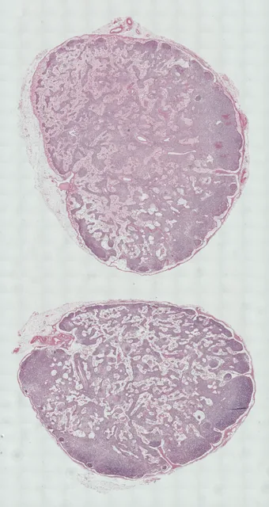</a> GEO `tissue_hires_image.png` |
| Human Lymph Node Visium CytAssist Gene and Protein Expression, Section D1 <code>2024_nm_human_lymph_nodes_D1</code> | [GSE263617](https://www.ncbi.nlm.nih.gov/geo/query/acc.cgi?acc=GSE263617) · [GSM8195496（RNA）](https://www.ncbi.nlm.nih.gov/geo/query/acc.cgi?acc=GSM8195496) · [GSM8195500（protein）](https://www.ncbi.nlm.nih.gov/geo/query/acc.cgi?acc=GSM8195500) | 未发现公开的原始 WSI H&E；GEO 仅提供 Space Ranger 预览/配准图像 | <a href="assets/static/database_thumbnails/2024_nm_human_lymph_nodes_D1.webp">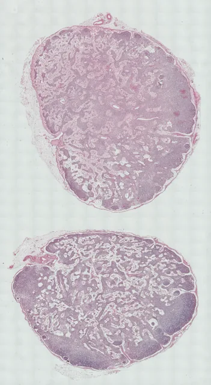</a> GEO `tissue_hires_image.png` |
| Human hippocampus 50 µm spatial ATAC-RNA-seq <code>GSE205055_human_hippocampus_50um_atac_rna</code> | [GSE205055](https://www.ncbi.nlm.nih.gov/geo/query/acc.cgi?acc=GSE205055) · [GSM6206884（ATAC）](https://www.ncbi.nlm.nih.gov/geo/query/acc.cgi?acc=GSM6206884) · [GSM6206885（RNA）](https://www.ncbi.nlm.nih.gov/geo/query/acc.cgi?acc=GSM6206885) | 未发现公开的原始 WSI H&E；样本空间归档仅含 PNG 预览 | <a href="assets/static/database_thumbnails/GSE205055_human_hippocampus_50um_atac_rna.webp">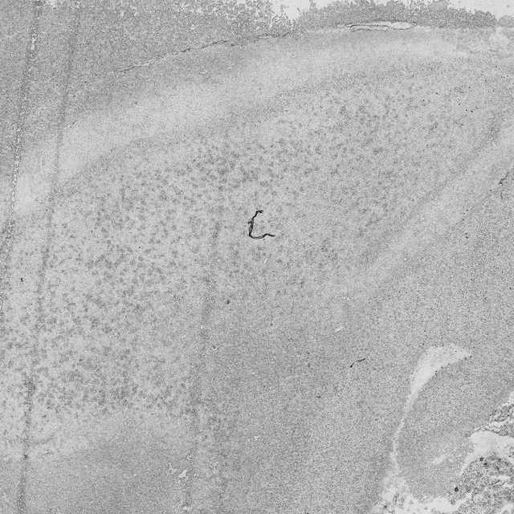</a> GSM6206885 `tissue_hires_image.png` |
| MISAR-seq Spatial RNA and ATAC in E13.5 Mouse Embryonic Brain (Section 1) <code>MISAR_seq_mouse_brain_E13_5_S1</code> | [OEP003285](https://www.biosino.org/node/project/detail/OEP003285) · [OED00772618](https://www.biosino.org/node/download/node/data/public/OED00772618) | 未发现原始 WSI；官方仅公开切片对应的 H&E JPEG | <a href="assets/static/database_thumbnails/MISAR_seq_mouse_brain_E13_5_S1.webp">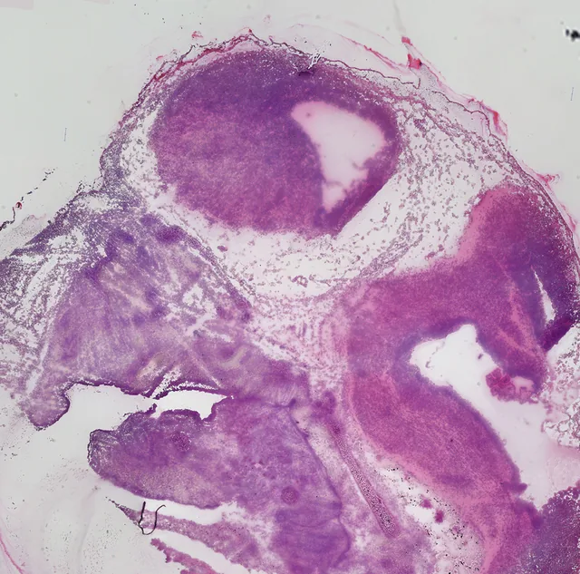</a> 官方 `E13_5-S1-HE.jpg` |
| MISAR-seq Spatial RNA and ATAC in E15.5 Mouse Embryonic Brain (Section 1) <code>MISAR_seq_mouse_brain_E15_5_S1</code> | [OEP003285](https://www.biosino.org/node/project/detail/OEP003285) · [OED00772632](https://www.biosino.org/node/download/node/data/public/OED00772632) | 未发现原始 WSI；官方仅公开切片对应的 H&E JPEG | <a href="assets/static/database_thumbnails/MISAR_seq_mouse_brain_E15_5_S1.webp">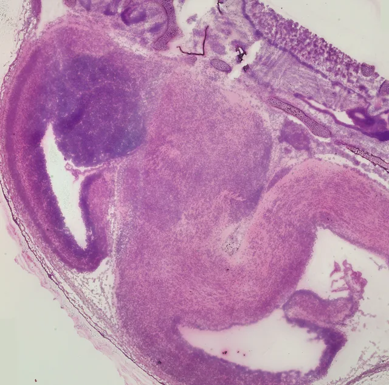</a> 官方 `E15_5-S1-HE.jpg` |
| MISAR-seq Spatial RNA and ATAC in E18.5 Mouse Embryonic Brain (Section 1) <code>MISAR_seq_mouse_brain_E18_5_S1</code> | [OEP003285](https://www.biosino.org/node/project/detail/OEP003285) · [OED00772642](https://www.biosino.org/node/download/node/data/public/OED00772642) | 未发现原始 WSI；官方仅公开切片对应的 H&E JPEG | <a href="assets/static/database_thumbnails/MISAR_seq_mouse_brain_E18_5_S1.webp">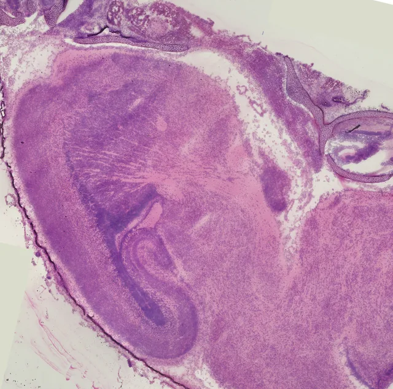</a> 官方 `E18_5-S1-HE.jpg` |
| Mouse brain P21 20 um spatial ATAC-RNA-seq replicate 2 <code>GSE205055_mouse_brain_p21_20um_atac_rna_rep2</code> | [GSE205055](https://www.ncbi.nlm.nih.gov/geo/query/acc.cgi?acc=GSE205055) · [GSM6758284（ATAC）](https://www.ncbi.nlm.nih.gov/geo/query/acc.cgi?acc=GSM6758284) · [GSM6753041（RNA）](https://www.ncbi.nlm.nih.gov/geo/query/acc.cgi?acc=GSM6753041) | 未发现公开的原始 WSI H&E；样本空间归档仅含 PNG 预览 | <a href="assets/static/database_thumbnails/GSE205055_mouse_brain_p21_20um_atac_rna_rep2.webp">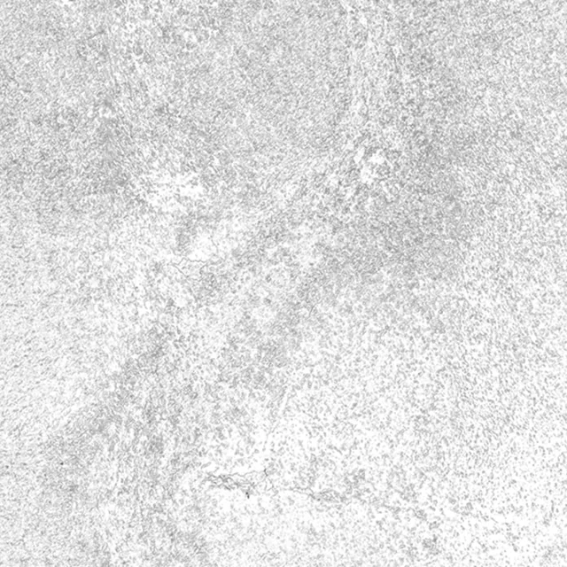</a> GSM6753041 `tissue_hires_image.png` |
| Mouse brain P21 20 um spatial H3K27ac and RNA replicate 2 <code>GSE205055_mouse_brain_p21_20um_h3k27ac_rna_rep2</code> | [GSE205055](https://www.ncbi.nlm.nih.gov/geo/query/acc.cgi?acc=GSE205055) · [GSM6704977（H3K27ac）](https://www.ncbi.nlm.nih.gov/geo/query/acc.cgi?acc=GSM6704977) · [GSM6753042（RNA）](https://www.ncbi.nlm.nih.gov/geo/query/acc.cgi?acc=GSM6753042) | 未发现公开的原始 WSI H&E；样本空间归档仅含 PNG 预览 | <a href="assets/static/database_thumbnails/GSE205055_mouse_brain_p21_20um_h3k27ac_rna_rep2.webp">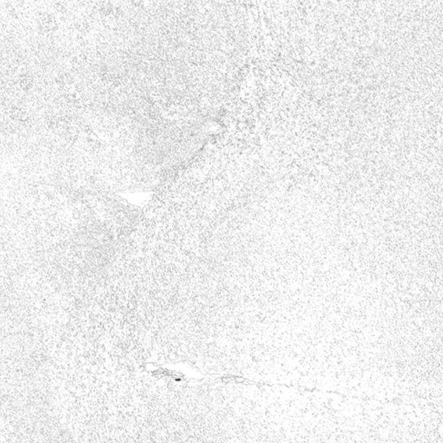</a> GSM6753042 `tissue_hires_image.png` |
| Mouse brain P21 20 µm spatial ATAC-RNA-seq <code>GSE205055_mouse_brain_p21_20um_atac_rna</code> | [GSE205055](https://www.ncbi.nlm.nih.gov/geo/query/acc.cgi?acc=GSE205055) · [GSM6204623（ATAC）](https://www.ncbi.nlm.nih.gov/geo/query/acc.cgi?acc=GSM6204623) · [GSM6204636（RNA）](https://www.ncbi.nlm.nih.gov/geo/query/acc.cgi?acc=GSM6204636) | 未发现公开的原始 WSI H&E；样本空间归档仅含 PNG 预览 | <a href="assets/static/database_thumbnails/GSE205055_mouse_brain_p21_20um_atac_rna.webp">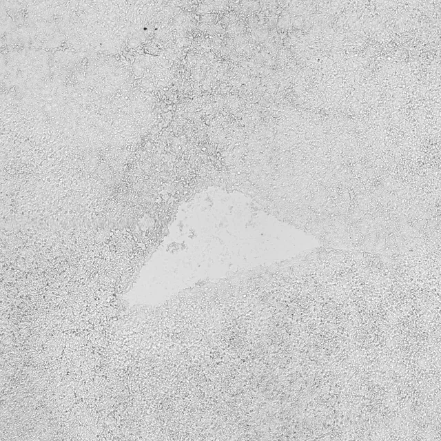</a> GSM6204636 `tissue_hires_image.png` |
| Mouse brain P21 20 µm spatial H3K27ac and RNA <code>GSE205055_mouse_brain_p21_20um_h3k27ac_rna</code> | [GSE205055](https://www.ncbi.nlm.nih.gov/geo/query/acc.cgi?acc=GSE205055) · [GSM6204621（H3K27ac）](https://www.ncbi.nlm.nih.gov/geo/query/acc.cgi?acc=GSM6204621) · [GSM6204635（RNA）](https://www.ncbi.nlm.nih.gov/geo/query/acc.cgi?acc=GSM6204635) | 未发现公开的原始 WSI H&E；样本空间归档仅含 PNG 预览 | <a href="assets/static/database_thumbnails/GSE205055_mouse_brain_p21_20um_h3k27ac_rna.webp">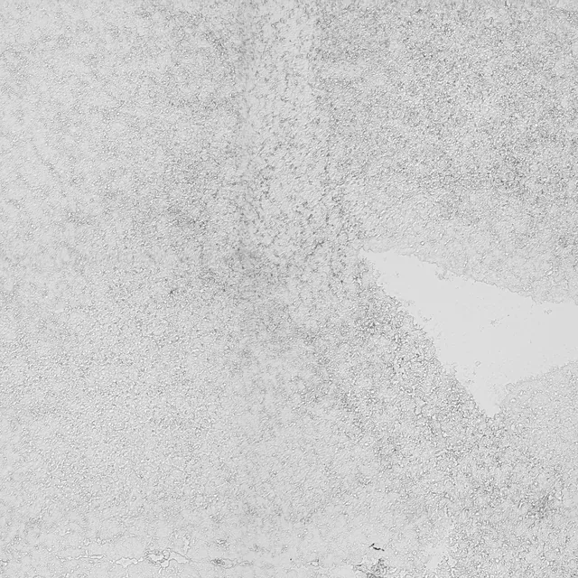</a> GSM6204635 `tissue_hires_image.png` |
| Mouse brain P22 20 um spatial ATAC-RNA <code>GSE205055_mouse_brain_p22_20um_atac_rna</code> | [GSE205055](https://www.ncbi.nlm.nih.gov/geo/query/acc.cgi?acc=GSE205055) · [GSM6758285（ATAC）](https://www.ncbi.nlm.nih.gov/geo/query/acc.cgi?acc=GSM6758285) · [GSM6753043（RNA）](https://www.ncbi.nlm.nih.gov/geo/query/acc.cgi?acc=GSM6753043) | 未发现公开的原始 WSI H&E；样本空间归档仅含 PNG 预览 | <a href="assets/static/database_thumbnails/GSE205055_mouse_brain_p22_20um_atac_rna.webp">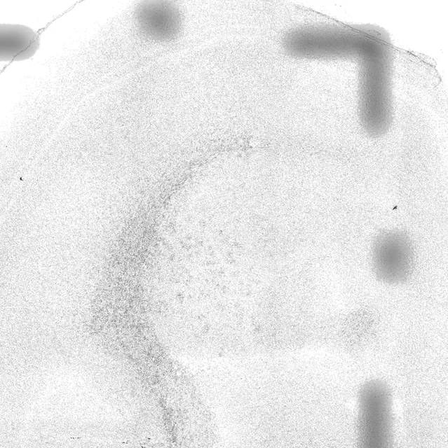</a> GSM6753043 `tissue_hires_image.png` |
| Mouse brain P22 20 um spatial H3K27ac and RNA <code>GSE205055_mouse_brain_p22_20um_h3k27ac_rna</code> | [GSE205055](https://www.ncbi.nlm.nih.gov/geo/query/acc.cgi?acc=GSE205055) · [GSM6704979（H3K27ac）](https://www.ncbi.nlm.nih.gov/geo/query/acc.cgi?acc=GSM6704979) · [GSM6753045（RNA）](https://www.ncbi.nlm.nih.gov/geo/query/acc.cgi?acc=GSM6753045) | 未发现公开的原始 WSI H&E；样本空间归档仅含 PNG 预览 | <a href="assets/static/database_thumbnails/GSE205055_mouse_brain_p22_20um_h3k27ac_rna.webp">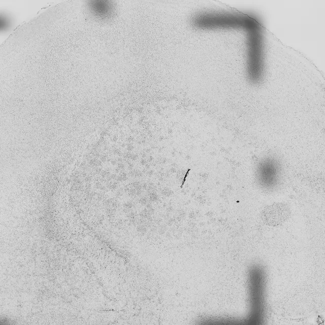</a> GSM6753045 `tissue_hires_image.png` |
| Mouse brain P22 20 µm spatial H3K27me3 and RNA <code>GSE205055_mouse_brain_p22_20um_h3k27me3_rna</code> | [GSE205055](https://www.ncbi.nlm.nih.gov/geo/query/acc.cgi?acc=GSE205055) · [GSM6704978（H3K27me3）](https://www.ncbi.nlm.nih.gov/geo/query/acc.cgi?acc=GSM6704978) · [GSM6753044（RNA）](https://www.ncbi.nlm.nih.gov/geo/query/acc.cgi?acc=GSM6753044) | 未发现公开的原始 WSI H&E；样本空间归档仅含 PNG 预览 | <a href="assets/static/database_thumbnails/GSE205055_mouse_brain_p22_20um_h3k27me3_rna.webp">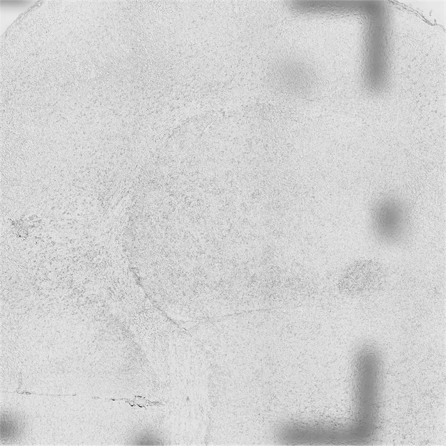</a> GSM6753044 `tissue_hires_image.png` |
| Mouse brain P22 20 µm spatial H3K4me3 and RNA <code>GSE205055_mouse_brain_p22_20um_h3k4me3_rna</code> | [GSE205055](https://www.ncbi.nlm.nih.gov/geo/query/acc.cgi?acc=GSE205055) · [GSM6704980（H3K4me3）](https://www.ncbi.nlm.nih.gov/geo/query/acc.cgi?acc=GSM6704980) · [GSM6753046（RNA）](https://www.ncbi.nlm.nih.gov/geo/query/acc.cgi?acc=GSM6753046) | 未发现公开的原始 WSI H&E；样本空间归档仅含 PNG 预览 | <a href="assets/static/database_thumbnails/GSE205055_mouse_brain_p22_20um_h3k4me3_rna.webp">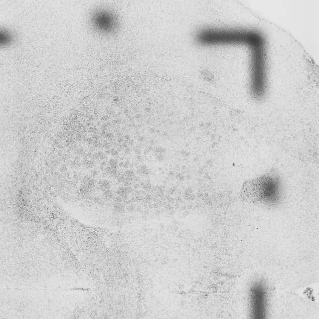</a> GSM6753046 `tissue_hires_image.png` |
| SPOTS Paired Spatial RNA and Protein Counts in Mouse Spleen, Replicate 1 <code>gse198353_spots_mouse_spleen_rep1</code> | [GSE198353](https://www.ncbi.nlm.nih.gov/geo/query/acc.cgi?acc=GSE198353) · [GSM5945505（RNA）](https://www.ncbi.nlm.nih.gov/geo/query/acc.cgi?acc=GSM5945505) · [GSM5945506（protein）](https://www.ncbi.nlm.nih.gov/geo/query/acc.cgi?acc=GSM5945506) | 未发现公开的原始 WSI H&E；系列空间归档仅含 PNG 预览 | <a href="assets/static/database_thumbnails/gse198353_spots_mouse_spleen_rep1.webp">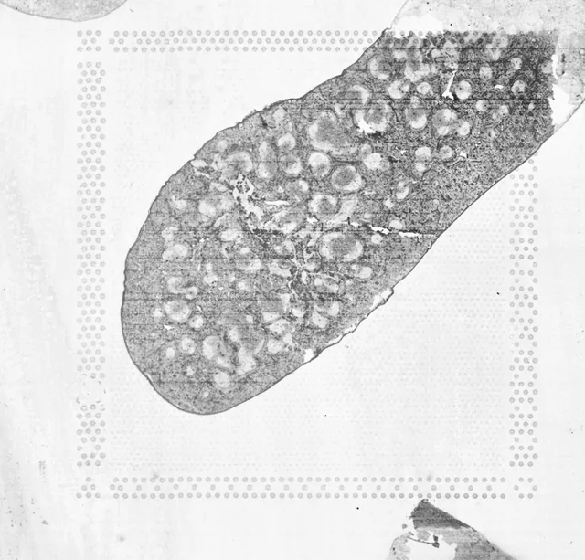</a> GEO `tissue_hires_image.png` |
| SPOTS Paired Spatial RNA and Protein Counts in Mouse Spleen, Replicate 2 <code>gse198353_spots_mouse_spleen_rep2</code> | [GSE198353](https://www.ncbi.nlm.nih.gov/geo/query/acc.cgi?acc=GSE198353) · [GSM5945507（RNA）](https://www.ncbi.nlm.nih.gov/geo/query/acc.cgi?acc=GSM5945507) · [GSM5945508（protein）](https://www.ncbi.nlm.nih.gov/geo/query/acc.cgi?acc=GSM5945508) | 未发现公开的原始 WSI H&E；系列空间归档仅含 PNG 预览 | <a href="assets/static/database_thumbnails/gse198353_spots_mouse_spleen_rep2.webp">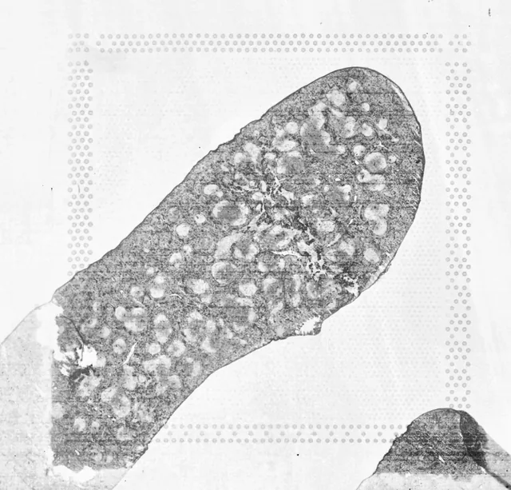</a> GEO `tissue_hires_image.png` |
| STARmap PLUS RNA and Alzheimer's Pathology in 13-Month TauPS2APP Mouse Brain, Replicate 1 <code>starmap_plus_ad_13m_disease_rep1</code> | [Zenodo 7683099](https://zenodo.org/records/7683099) | 未发现对应的 WSI H&E；[官方图像归档 ZIP（48.5 MB）](https://zenodo.org/api/records/7683099/files/2022-11-17-mAD-2766-genes-protein-images.zip/content) 内的精确路径为 `13months_disease-replicate_1/plaque.tif` | <a href="https://zenodo.org/api/records/7683099/files/2022-11-17-mAD-2766-genes-protein-images.zip/content">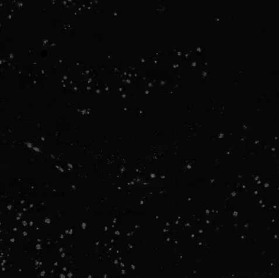</a> 由官方 `plaque.tif` 以 14×14 最大值池化确定性生成；非 H&E |
| STARmap PLUS RNA and Alzheimer's Pathology in 13-Month TauPS2APP Mouse Brain, Replicate 2 <code>starmap_plus_ad_13m_disease_rep2</code> | [Zenodo 7683099](https://zenodo.org/records/7683099) | 未发现对应的 WSI H&E；[官方图像归档 ZIP（48.5 MB）](https://zenodo.org/api/records/7683099/files/2022-11-17-mAD-2766-genes-protein-images.zip/content) 内的精确路径为 `13months_disease-replicate_2/plaque.tif` | <a href="https://zenodo.org/api/records/7683099/files/2022-11-17-mAD-2766-genes-protein-images.zip/content">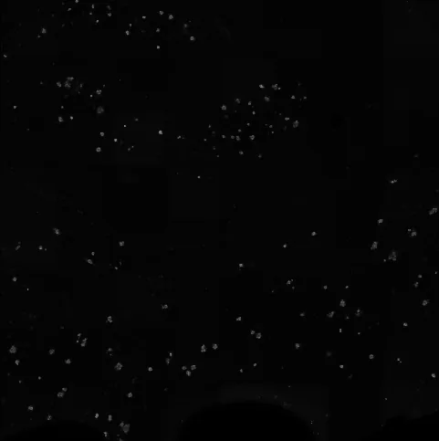</a> 由官方 `plaque.tif` 以 14×14 最大值池化确定性生成；非 H&E |
| Spatial ATAC and RNA profiling of a mouse embryo at E13 with 50 micrometer bins <code>GSE205055_mouse_embryo_e13_50um_atac_rna</code> | [GSE205055](https://www.ncbi.nlm.nih.gov/geo/query/acc.cgi?acc=GSE205055) · [GSM6801813（ATAC）](https://www.ncbi.nlm.nih.gov/geo/query/acc.cgi?acc=GSM6801813) · [GSM6799937（RNA）](https://www.ncbi.nlm.nih.gov/geo/query/acc.cgi?acc=GSM6799937) | 未发现公开的原始 WSI H&E；样本空间归档仅含 PNG 预览 | <a href="assets/static/database_thumbnails/GSE205055_mouse_embryo_e13_50um_atac_rna.webp">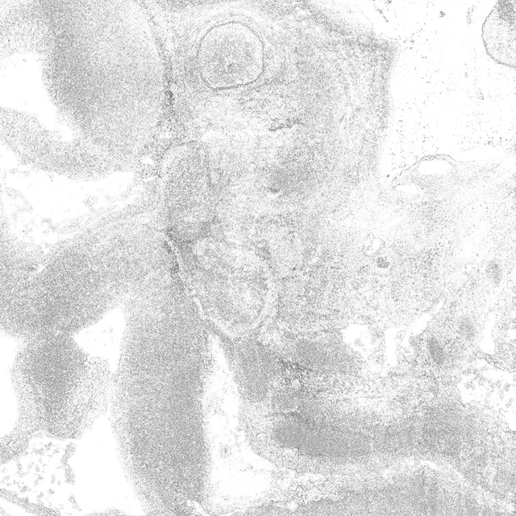</a> GSM6799937 `tissue_hires_image.png` |
| Spatial ATAC and RNA profiling of mouse embryo at E13 with 25 µm bins <code>GSE205055_mouse_embryo_e13_25um_atac_rna</code> | [GSE205055](https://www.ncbi.nlm.nih.gov/geo/query/acc.cgi?acc=GSE205055) · [GSM6204624（ATAC）](https://www.ncbi.nlm.nih.gov/geo/query/acc.cgi?acc=GSM6204624) · [GSM6204637（RNA）](https://www.ncbi.nlm.nih.gov/geo/query/acc.cgi?acc=GSM6204637) | 未发现公开的原始 WSI H&E；样本空间归档仅含 PNG 预览 | <a href="assets/static/database_thumbnails/GSE205055_mouse_embryo_e13_25um_atac_rna.webp">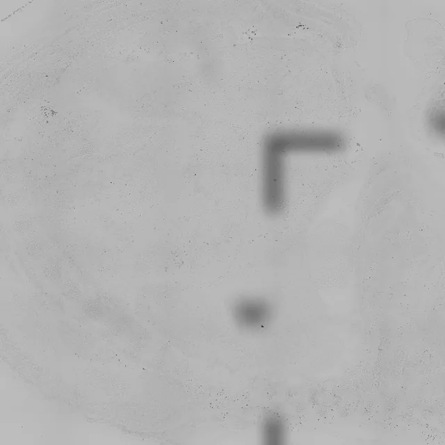</a> GSM6204637 `tissue_hires_image.png` |
| Spatial-CITE-seq human glioblastoma (GBM) brain <code>GSE213264_human_gbm_spatial_citeseq</code> | [GSE213264](https://www.ncbi.nlm.nih.gov/geo/query/acc.cgi?acc=GSE213264) · [GSM6578066（RNA）](https://www.ncbi.nlm.nih.gov/geo/query/acc.cgi?acc=GSM6578066) · [GSM6578075（protein）](https://www.ncbi.nlm.nih.gov/geo/query/acc.cgi?acc=GSM6578075) | 未发现对应的 WSI H&E；GEO 仅公开表达矩阵/SRA，作者显微图目录和 Figshare 20723680 均无 GBM 图像 | 未找到可公开下载且能唯一对应本样本的缩略图 |
| Spatial-CITE-seq human skin <code>GSE213264_human_skin_spatial_citeseq</code> | [GSE213264](https://www.ncbi.nlm.nih.gov/geo/query/acc.cgi?acc=GSE213264) · [GSM6578065（RNA）](https://www.ncbi.nlm.nih.gov/geo/query/acc.cgi?acc=GSM6578065) · [GSM6578074（protein）](https://www.ncbi.nlm.nih.gov/geo/query/acc.cgi?acc=GSM6578074) | 未发现对应的 WSI H&E；[作者官方 human/skin.jpg](https://raw.githubusercontent.com/edicliuyang/Hiplex_proteome/main/Tissue%20images_manuscript/human/skin.jpg) 为普通显微 JPEG | <a href="https://raw.githubusercontent.com/edicliuyang/Hiplex_proteome/main/Tissue%20images_manuscript/human/skin.jpg">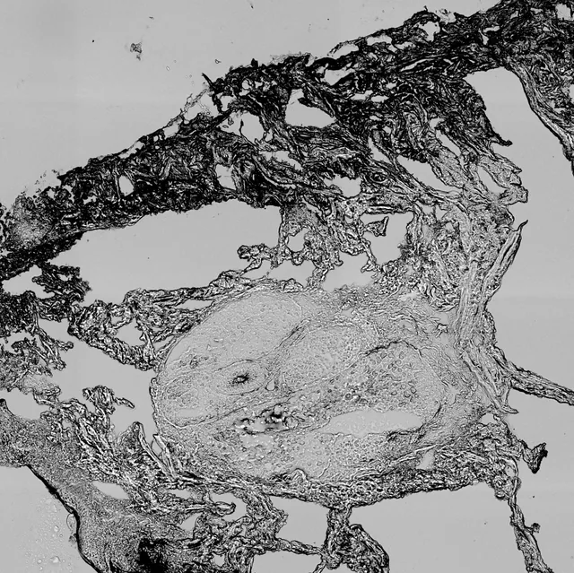</a> 作者仓库 `human/skin.jpg`；亦见 Figshare 文件 36943588 |
| Spatial-CITE-seq human spleen <code>GSE213264_human_spleen_spatial_citeseq</code> | [GSE213264](https://www.ncbi.nlm.nih.gov/geo/query/acc.cgi?acc=GSE213264) · [GSM6578063（RNA）](https://www.ncbi.nlm.nih.gov/geo/query/acc.cgi?acc=GSM6578063) · [GSM6578072（protein）](https://www.ncbi.nlm.nih.gov/geo/query/acc.cgi?acc=GSM6578072) | 未发现对应的 WSI H&E；[作者官方 human/spleen.jpg](https://raw.githubusercontent.com/edicliuyang/Hiplex_proteome/main/Tissue%20images_manuscript/human/spleen.jpg) 为普通显微 JPEG | <a href="https://raw.githubusercontent.com/edicliuyang/Hiplex_proteome/main/Tissue%20images_manuscript/human/spleen.jpg">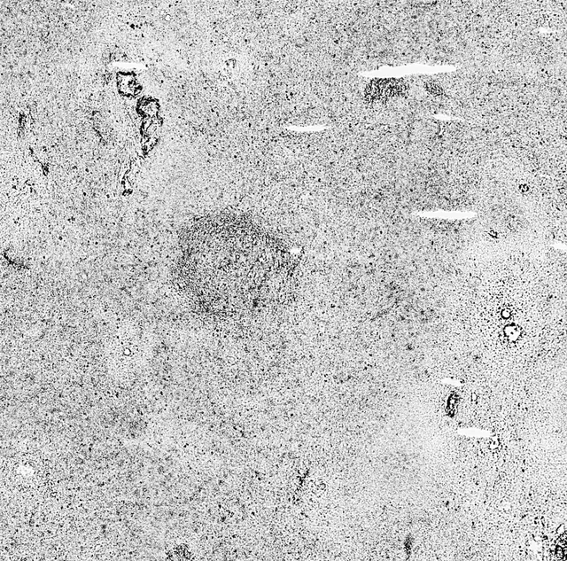</a> 作者仓库 `human/spleen.jpg`；Figshare 文件 36943615 |
| Spatial-CITE-seq human thymus <code>GSE213264_human_thymus_spatial_citeseq</code> | [GSE213264](https://www.ncbi.nlm.nih.gov/geo/query/acc.cgi?acc=GSE213264) · [GSM6578064（RNA）](https://www.ncbi.nlm.nih.gov/geo/query/acc.cgi?acc=GSM6578064) · [GSM6578073（protein）](https://www.ncbi.nlm.nih.gov/geo/query/acc.cgi?acc=GSM6578073) | 未发现对应的 WSI H&E；[作者官方 human/thymus.jpg](https://raw.githubusercontent.com/edicliuyang/Hiplex_proteome/main/Tissue%20images_manuscript/human/thymus.jpg) 为普通显微 JPEG | <a href="https://raw.githubusercontent.com/edicliuyang/Hiplex_proteome/main/Tissue%20images_manuscript/human/thymus.jpg">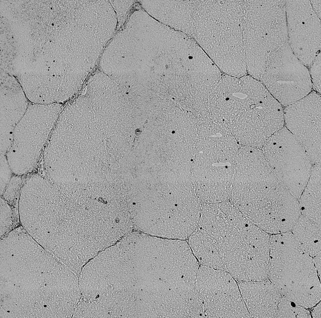</a> 作者仓库 `human/thymus.jpg`；Figshare 文件 36943639 |
| Spatial-CITE-seq human tonsil <code>GSE213264_human_tonsil_spatial_citeseq</code> | [GSE213264](https://www.ncbi.nlm.nih.gov/geo/query/acc.cgi?acc=GSE213264) · [GSM6578062（RNA）](https://www.ncbi.nlm.nih.gov/geo/query/acc.cgi?acc=GSM6578062) · [GSM6578071（protein）](https://www.ncbi.nlm.nih.gov/geo/query/acc.cgi?acc=GSM6578071) | 未发现对应的 WSI H&E；[作者官方 human/tonsil.jpg](https://raw.githubusercontent.com/edicliuyang/Hiplex_proteome/main/Tissue%20images_manuscript/human/tonsil.jpg) 为普通显微 JPEG | <a href="https://raw.githubusercontent.com/edicliuyang/Hiplex_proteome/main/Tissue%20images_manuscript/human/tonsil.jpg">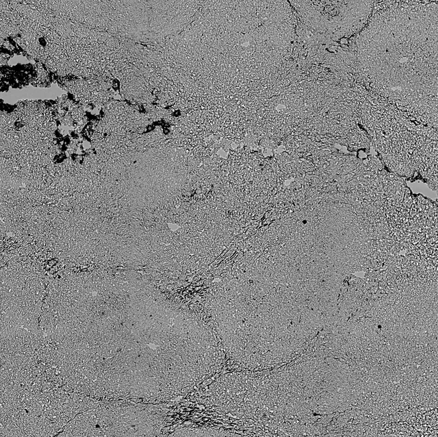</a> 作者仓库 `human/tonsil.jpg`；Figshare 文件 36943621 |
| Spatial-CITE-seq mouse colon <code>GSE213264_mouse_colon_spatial_citeseq</code> | [GSE213264](https://www.ncbi.nlm.nih.gov/geo/query/acc.cgi?acc=GSE213264) · [GSM6578059（RNA）](https://www.ncbi.nlm.nih.gov/geo/query/acc.cgi?acc=GSM6578059) · [GSM6578068（protein）](https://www.ncbi.nlm.nih.gov/geo/query/acc.cgi?acc=GSM6578068) | 未发现对应的 WSI H&E；[作者官方 mouse/colon.jpg](https://raw.githubusercontent.com/edicliuyang/Hiplex_proteome/main/Tissue%20images_manuscript/mouse/colon.jpg) 为普通明场 JPEG | <a href="https://raw.githubusercontent.com/edicliuyang/Hiplex_proteome/main/Tissue%20images_manuscript/mouse/colon.jpg">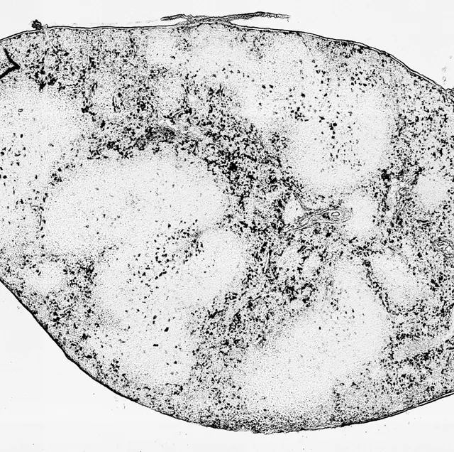</a> 作者仓库 `mouse/colon.jpg`；Figshare 文件 36943606 |
| Spatial-CITE-seq mouse intestine <code>GSE213264_mouse_intestine_spatial_citeseq</code> | [GSE213264](https://www.ncbi.nlm.nih.gov/geo/query/acc.cgi?acc=GSE213264) · [GSM6578060（RNA）](https://www.ncbi.nlm.nih.gov/geo/query/acc.cgi?acc=GSM6578060) · [GSM6578069（protein）](https://www.ncbi.nlm.nih.gov/geo/query/acc.cgi?acc=GSM6578069) | 未发现对应的 WSI H&E；[作者官方 mouse/intestine.jpg](https://raw.githubusercontent.com/edicliuyang/Hiplex_proteome/main/Tissue%20images_manuscript/mouse/intestine.jpg) 为普通明场 JPEG | <a href="https://raw.githubusercontent.com/edicliuyang/Hiplex_proteome/main/Tissue%20images_manuscript/mouse/intestine.jpg">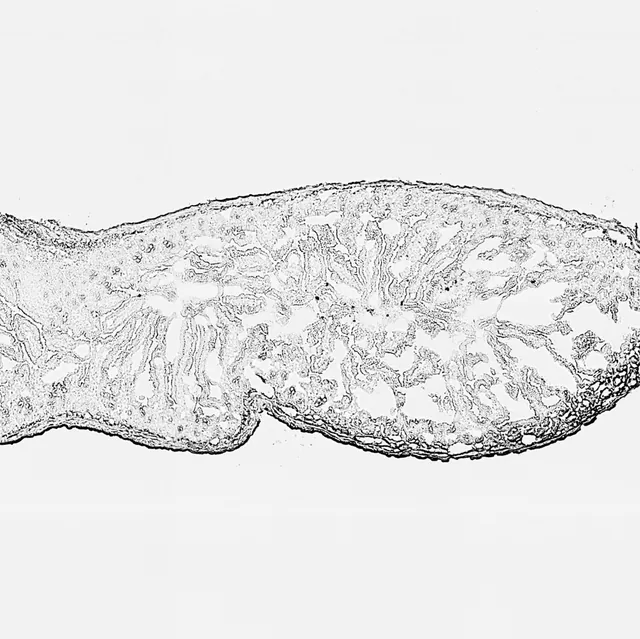</a> 作者仓库 `mouse/intestine.jpg`；Figshare 文件 36943630 |
| Spatial-CITE-seq mouse kidney <code>GSE213264_mouse_kidney_spatial_citeseq</code> | [GSE213264](https://www.ncbi.nlm.nih.gov/geo/query/acc.cgi?acc=GSE213264) · [GSM6578061（RNA）](https://www.ncbi.nlm.nih.gov/geo/query/acc.cgi?acc=GSM6578061) · [GSM6578070（protein）](https://www.ncbi.nlm.nih.gov/geo/query/acc.cgi?acc=GSM6578070) | 未发现对应的 WSI H&E；[作者官方 mouse/kidney.jpg](https://raw.githubusercontent.com/edicliuyang/Hiplex_proteome/main/Tissue%20images_manuscript/mouse/kidney.jpg) 为普通明场 JPEG | <a href="https://raw.githubusercontent.com/edicliuyang/Hiplex_proteome/main/Tissue%20images_manuscript/mouse/kidney.jpg">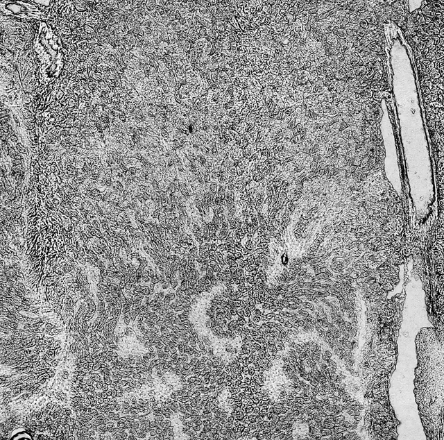</a> 作者仓库 `mouse/kidney.jpg`；Figshare 文件 36943636（`kidney_processed.jpg`） |
| Spatial-CITE-seq mouse spleen <code>GSE213264_mouse_spleen_spatial_citeseq</code> | [GSE213264](https://www.ncbi.nlm.nih.gov/geo/query/acc.cgi?acc=GSE213264) · [GSM6578058（RNA）](https://www.ncbi.nlm.nih.gov/geo/query/acc.cgi?acc=GSM6578058) · [GSM6578067（protein）](https://www.ncbi.nlm.nih.gov/geo/query/acc.cgi?acc=GSM6578067) | 未发现对应的 WSI H&E；[作者官方 mouse/spleen.jpg](https://raw.githubusercontent.com/edicliuyang/Hiplex_proteome/main/Tissue%20images_manuscript/mouse/spleen.jpg) 为普通明场 JPEG | <a href="https://raw.githubusercontent.com/edicliuyang/Hiplex_proteome/main/Tissue%20images_manuscript/mouse/spleen.jpg">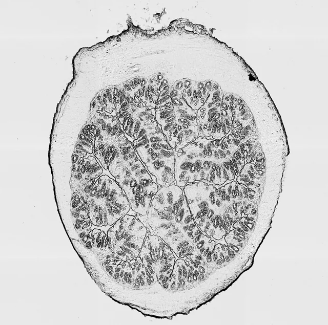</a> 作者仓库 `mouse/spleen.jpg`；Figshare 文件 36943642 |
| Stereo-CITE-seq Mouse Thymus RNA and 19-ADT, sample_01 <code>zenodo_10362607_stereo_cite_seq_mouse_thymus_19adt_sample_01</code> | [STT0000094](https://db.cngb.org/stomics/project/STT0000094) · [Zenodo 10362607](https://zenodo.org/records/10362607) · [Nature Methods 论文](https://www.nature.com/articles/s41592-024-02316-4) | 未发现对应的 WSI H&E；项目染色协议为 IF，论文 mouse thymus 1 图像为 dsDNA | <a href="https://cdn.ncbi.nlm.nih.gov/pmc/blobs/2875/11399094/16f50873f5e5/41592_2024_2316_Fig12_ESM.jpg">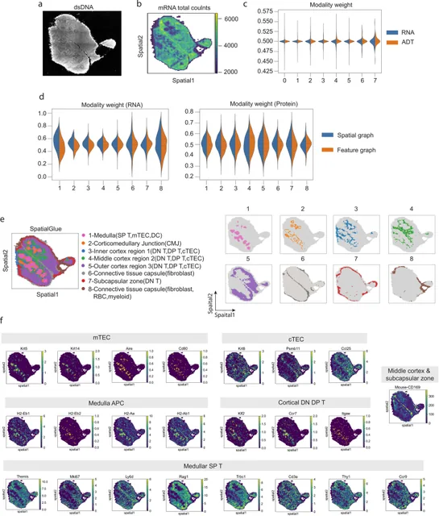</a> 官方 Extended Data Fig. 8；panel a 为 dsDNA；整图是只对应 mouse thymus 1 的论文组合图 |
| Stereo-CITE-seq Mouse Thymus RNA and 19-ADT, sample_02 <code>zenodo_10362607_stereo_cite_seq_mouse_thymus_19adt_sample_02</code> | [STT0000094](https://db.cngb.org/stomics/project/STT0000094) · [Zenodo 10362607](https://zenodo.org/records/10362607) | 未发现对应的 WSI H&E；项目成像类型为 dsDNA/荧光，不是 H&E | 未找到可公开下载且能唯一对应 `sample_02` 的独立缩略图 |
| Stereo-CITE-seq Mouse Thymus RNA and 19-ADT, sample_03 <code>zenodo_10362607_stereo_cite_seq_mouse_thymus_19adt_sample_03</code> | [STT0000094](https://db.cngb.org/stomics/project/STT0000094) · [Zenodo 10362607](https://zenodo.org/records/10362607) | 未发现对应的 WSI H&E；项目成像类型为 dsDNA/荧光，不是 H&E | 未找到可公开下载且能唯一对应 `sample_03` 的独立缩略图 |
| Visium CytAssist Gene and Protein Expression in FFPE Human Tonsil <code>visium_human_tonsil_rna_protein</code> | [10x Genomics 数据记录](https://www.10xgenomics.com/datasets/gene-protein-expression-library-of-human-tonsil-cytassist-ffpe-2-standard) | [同切片 H&E 全分辨率 TIFF（约 3.82 GB）](https://cf.10xgenomics.com/samples/spatial-exp/2.1.0/CytAssist_FFPE_Protein_Expression_Human_Tonsil/CytAssist_FFPE_Protein_Expression_Human_Tonsil_tissue_image.tif) | <a href="https://cf.10xgenomics.com/samples/spatial-exp/2.1.0/CytAssist_FFPE_Protein_Expression_Human_Tonsil/CytAssist_FFPE_Protein_Expression_Human_Tonsil_tissue_image.tif">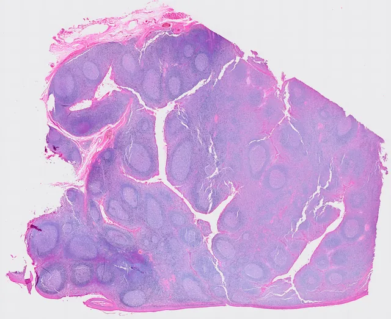</a> 10x `tissue_hires_image.png` |
| Xenium Gene and Protein Expression in FFPE Human Renal Cell Carcinoma <code>xenium_human_rcc_ffpe_rna_protein</code> | [10x Genomics 数据记录](https://www.10xgenomics.com/datasets/xenium-protein-ffpe-human-renal-carcinoma) · [官方分析摘要](https://cf.10xgenomics.com/samples/xenium/4.0.0/Xenium_V1_Human_Kidney_FFPE_Protein_updated/Xenium_V1_Human_Kidney_FFPE_Protein_updated_analysis_summary.html) | [同切片 post-Xenium H&E OME-TIFF（约 3.72 GB）](https://cf.10xgenomics.com/samples/xenium/4.0.0/Xenium_V1_Human_Kidney_FFPE_Protein_updated/Xenium_V1_Human_Kidney_FFPE_Protein_updated_he_image.ome.tif) | <a href="https://cf.10xgenomics.com/samples/xenium/4.0.0/Xenium_V1_Human_Kidney_FFPE_Protein_updated/Xenium_V1_Human_Kidney_FFPE_Protein_updated_analysis_summary.html">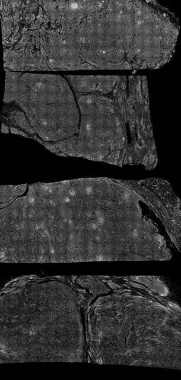</a> 10x 官方分析摘要内嵌 `overview_scan`；标题为 `Human FFPE Kidney - Human Renal Cell Carcinoma (FFPE)` |
| Xenium RNA and Immunofluorescence Protein Profiling of FFPE Human Breast Cancer, Replicate 1 <code>2023_nc_10x_breast_cancer_HBC_rep1</code> | [10x Genomics 数据记录](https://www.10xgenomics.com/products/xenium-in-situ/preview-dataset-human-breast) · [GSM7780153](https://www.ncbi.nlm.nih.gov/geo/query/acc.cgi?acc=GSM7780153) | [同切片 H&E OME-TIFF（约 1.43 GB）](https://cf.10xgenomics.com/samples/xenium/1.0.1/Xenium_FFPE_Human_Breast_Cancer_Rep1/Xenium_FFPE_Human_Breast_Cancer_Rep1_he_image.ome.tif) [同切片 H&E TIFF（约 1.70 GB）](https://cf.10xgenomics.com/samples/xenium/1.0.1/Xenium_FFPE_Human_Breast_Cancer_Rep1/Xenium_FFPE_Human_Breast_Cancer_Rep1_he_image.tif) | <a href="https://cf.10xgenomics.com/samples/xenium/1.0.1/Xenium_FFPE_Human_Breast_Cancer_Rep1/Xenium_FFPE_Human_Breast_Cancer_Rep1_he_image.ome.tif">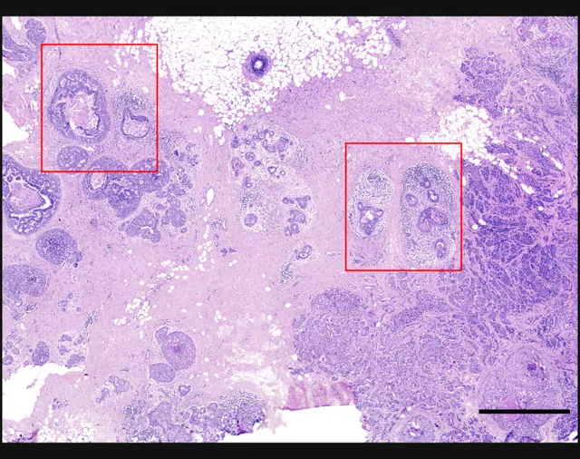</a> 10x 官方 H&E 切片预览 |

## 本地 WSI 入库状态

2026-08-12 已将三个可下载 WSI 作为所属 Database 的辅助文件注册。网站辅助文件 ID 均为
`he_wsi`；可从所属数据详情页或
`/downloads/<dataset_id>/auxiliary/he_wsi` 下载。文件保存在
`data/datasets/<dataset_id>/auxiliary/`，不会形成独立目录条目或详情页。断点续传、完整性校验和
使用权限说明见[数据使用说明](数据使用说明.md)。

| 数据集 ID | 入库文件 | 字节数 | SHA-256 |
| --- | --- | ---: | --- |
| `visium_human_tonsil_rna_protein` | `CytAssist_FFPE_Protein_Expression_Human_Tonsil_tissue_image.tif` | 3,815,082,301 | `087a07f8464174a3f9c5b6300c8aadf52591c1be3b6a50922797fbec7fa5ff4c` |
| `xenium_human_rcc_ffpe_rna_protein` | `Xenium_V1_Human_Kidney_FFPE_Protein_updated_he_image.ome.tif` | 3,720,697,771 | `5e3e35fd6dd6122a3927c01aff273a25846d7a2532191b547eeacba46e1dacde` |
| `2023_nc_10x_breast_cancer_HBC_rep1` | `Xenium_FFPE_Human_Breast_Cancer_Rep1_he_image.ome.tif` | 1,427,110,955 | `3c2bd89588f97e886dc1288e68d4eaae1b21231cd59774bc01d2d7e3876430f0` |

乳腺癌条目只入库 OME-TIFF，没有重复保存普通 TIFF 版本。三个正式副本均已通过远端长度、
本地长度、SHA-256、TIFF/BigTIFF 首 IFD、OME XML、manifest、详情页、JSON API、HEAD 和 Range
下载验证。

## 核查说明

- “未发现”表示在数据集记录页、原始数据仓库及其公开补充文件中未找到满足上述严格定义的文件，不表示研究过程中一定没有采集过组织图像。
- GSE205055、GSE198353 和 GSE263617 的 `tissue_hires_image.png` 是平台生成或随 Space Ranger 空间目录发布的预览图，只作为缩略图保存，不能据此声称原始 WSI 已公开。
- MISAR-seq 的三个 `*-HE.jpg` 能与阶段和 Section 1 精确对应，因此作为缩略图收录；它们是 JPEG，不按 WSI 计数。
- GSE213264 的 8 张显微 JPEG 同时出现在 Figshare 20723680 和作者官方 GitHub 的 `Tissue images_manuscript/{human,mouse}/` 目录。物种目录解决了两个同名 `spleen.jpg` 的歧义：Figshare 36943615 为 human spleen，36943642 为 mouse spleen。GEO 中的 GBM 是第 9 个样本，但上述两个官方图像源均没有 GBM 文件，因此不做推断性替代。
- STARmap PLUS 两个缩略图从 Zenodo 官方归档中各自样本目录下的 `plaque.tif` 生成，原 TIFF 与数据集 replicate 名称一一对应；这些是淀粉样斑块病理图像，不是 H&E。
- Stereo-CITE-seq 的 Zenodo 处理包只含 RNA/ADT H5AD，没有独立图像。仅 `sample_01` 能与论文明确标注的 “mouse thymus 1” Extended Data Fig. 8 一一对应；`sample_02`、`sample_03` 未使用其他切片图像代替。STOmicsDB 原项目的组织切片染色协议为 IF，不是 H&E。
- Xenium RCC 缩略图直接解码自同一 10x 分析摘要的 `overview_scan` 字段；页面样本标题和本库切片一致。其 H&E WSI 仍使用 10x 发布的同一运行 OME-TIFF。
- 完整性校验：报告中的 35 个数据集 ID 与 `catalog.db` 的 35 个 `full` 数据集逐项一致且无重复；32 个网页图片链接均存在、可解码为 WebP，且最长边不超过 640 px。采集阶段保存的 GSE213264 8 张原图均与作者 GitHub API 返回的 Git blob SHA-1 一致；STARmap ZIP 的 MD5 为 Zenodo 记录给出的 `a7f5a84973bf7bfd58ebb1ea03a7bb3c`；Stereo-CITE-seq 论文图的 MD5 与 PMC 元数据 `16f50873f5e56bef321cebcc03b9fba1` 一致。
- 提交到仓库的网页缩略图均保存在 [`assets/static/database_thumbnails/`](assets/static/database_thumbnails/)；文件名严格使用 `<dataset_id>.webp`，供 Database 目录页和详情页自动匹配。缩略图采集阶段下载的原始图像仅在本地 `assets/he_wsi_thumbnails/` 保留；正式入库的三个 WSI 则位于所属数据集的 `auxiliary/` 子目录。两处均已忽略且不纳入版本控制。缺少 WebP 的 3 个条目在网页中不显示占位图像。
